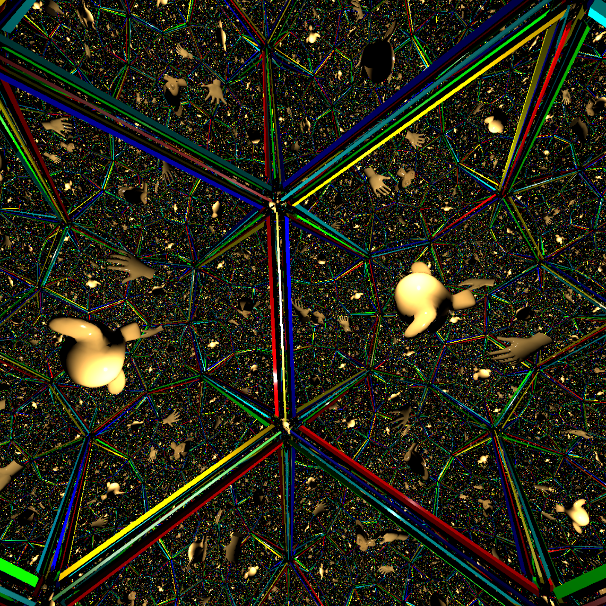

<table>
<tr>
<td markdown="1">

</td>
<td markdown="1" style="text-align: justify" width="80%">

I'm a Researcher in my second Postdoc at [PUC-Rio](https://www.puc-rio.br/english/ "PUC-Rio's Homepage"), supervised by [Hélio Lopes](http://www-di.inf.puc-rio.br/~lopes/ "Hélio Lopes's Homepage").

My first Postdoc was at [IMPA](https://impa.br/en_US/ "IMPA's Homepage"), supervised by [Luiz Velho](http://lvelho.impa.br/ "Luiz Velho's Homepage").

My research interests are mostly related with real-time Computer Graphics, Virtual Reality, Games and Machine Learning. My current focus is Real-time Ray Tracing and its applications in Virtual Reality, Non-euclidean spaces and Differentiable Rendering. I also work with R&D in real-world problems involving Data Science and Machine Learning.

</td>
</tr>
</table>

# Publications

## 2020

<table>

<tr>
<td markdown="1">

</td>
<td markdown="1" width="60%">
        
### Silva, Novello, Lopes, Velho, [Proceduray - A light-weight engine for procedural primitive ray tracing](https://arxiv.org/abs/2012.10357), Arxiv

</td>
</tr>

<tr>
<td markdown="1">

</td>
<td markdown="1" width="60%">
        
### Novello, Silva, Velho, [Global Illumination of Non-Euclidean Spaces](https://doi.org/10.1016/j.cag.2020.09.014), Computers & Graphics, [Preprint](https://arxiv.org/abs/2003.11133)

</td>
</tr>

<tr>
<td markdown="1">

</td>
<td markdown="1" width="60%">
        
### Novello, Silva, Velho, [Visualization of Nil, Sol, and SL2 geometries](https://doi.org/10.1016/j.cag.2020.07.016), Computers & Graphics, [Preprint](https://www.visgraf.impa.br/Data/RefBib/PS_PDF/cag2020a/Visualization_of_Nil_Sol_SL2_CAG.pdf)

</td>
</tr>

<tr>
<td markdown="1">

</td>
<td markdown="1" width="60%">
        
### Velho, Silva, Novello, [Immersive Visualization of the Classical Non-Euclidean Spaces using Real-Time Ray Tracing in VR](https://doi.org/10.20380/GI2020.42), Graphics Interface 2020)

</td>
</tr>

</table>
