<table>
<tr>
<td markdown="1">

 
 

</td>
<td markdown="1" style="text-align: justify" width="70%">

I'm a Researcher in my second Postdoc at [PUC-Rio](https://www.puc-rio.br/english/ "PUC-Rio's Homepage"), supervised by [Hélio Lopes](http://www-di.inf.puc-rio.br/~lopes/ "Hélio Lopes's Homepage").

My first Postdoc was at [IMPA](https://impa.br/en_US/ "IMPA's Homepage"), supervised by [Luiz Velho](http://lvelho.impa.br/ "Luiz Velho's Homepage").

My research interests are mostly related with real-time Computer Graphics, Games, Virtual Reality and Machine Learning. My current focus is Real-time Ray Tracing and its applications on Procedural Geometry, Neural Implicits, Non-euclidean spaces, and Virtual Reality. I also work with R&D in real-world problems involving Data Science and Machine Learning.

---
**dsilva --dot-- vinicius --at-- gmail --dot-- com**

---

</td>
</tr>
</table>

# Selected Publications

## 2022

<table>

<tr>
<td markdown="1">

<a href="figs/highres/rayvr_project4.jpg">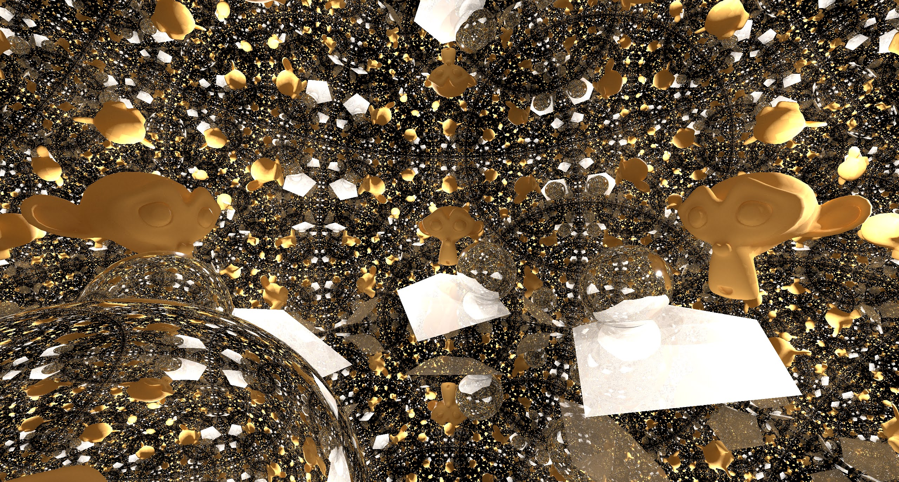</a>

</td>
<td markdown="1" width="60%">
        
### Novello, Silva, Velho, [GPU Ray Tracing in Non-Euclidean Spaces](https://doi.org/10.2200/S01164ED1V01Y202202VCP034), Synthesis Lectures on Visual Computing, Morgan & Claypool Publishers.

</td>
</tr>

<!--
<tr>
<td markdown="1">

<a href="figs/mip-plicits.JPEG">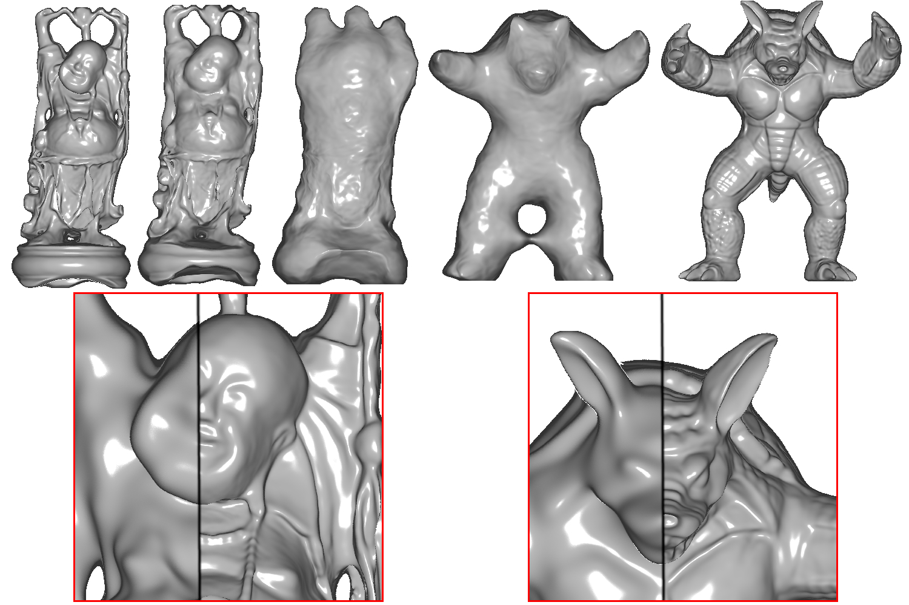</a>

</td>
<td markdown="1" width="60%">
        
### Silva, Novello, Schardong, Schirmer, Lopes, Velho, [MIP-plicits: Level of Detail Factorization of Neural Implicits Sphere Tracing](https://dsilvavinicius.github.io/mip-plicits/), Arxiv.

</td>
</tr>

<tr>
<td markdown="1">

<a href="figs/i4d.jpg">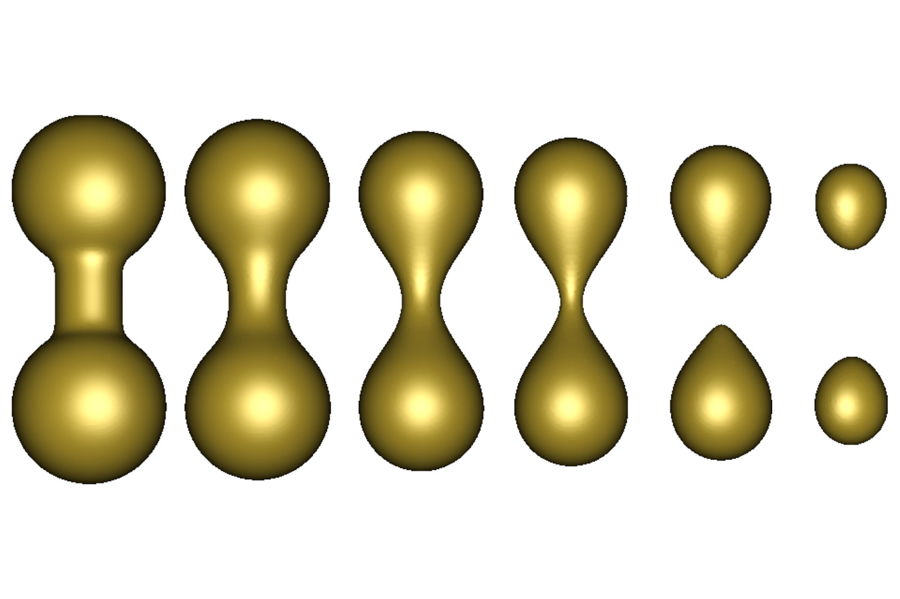</a>

</td>
<td markdown="1" width="60%">
        
### Novello, Silva, Schardong, Schirmer, Lopes, Velho, [Neural Implicit Surfaces in Higher Dimension](https://dsilvavinicius.github.io/neural_implicit_surfaces_in_higher_dimension/), Arxiv.

</td>
</tr>

<tr>
<td markdown="1">

<a href="figs/i3d.jpg">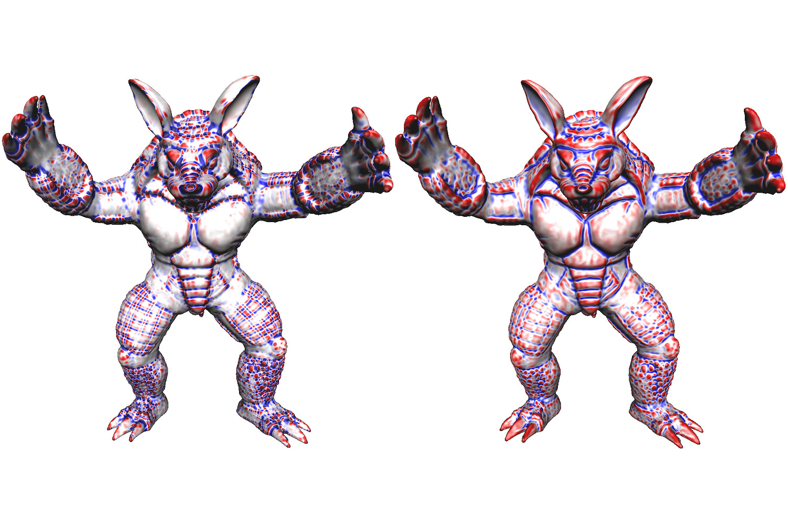</a>

</td>
<td markdown="1" width="60%">
        
### Novello, Silva, Schardong, Schirmer, Lopes, Velho, [Differential Geometry in Neural Implicits](https://dsilvavinicius.github.io/differential_geometry_in_neural_implicits/), Arxiv.

</td>
</tr>
-->

</table>

## 2021

<table>

<tr>
<td markdown="1">

<a href="figs/highres/julia_cut.png">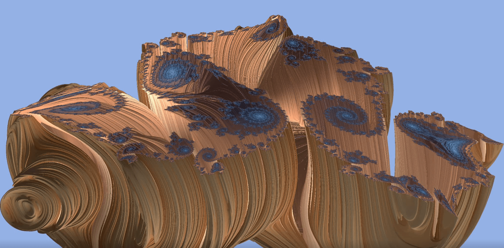</a>

</td>
<td markdown="1" width="60%">
        
### Silva, Novello, Lopes, Velho, [Real-time Rendering of Complex Fractals](https://link.springer.com/chapter/10.1007/978-1-4842-7185-8_33), [Ray Tracing Gems 2](https://www.realtimerendering.com/raytracinggems/rtg2/index.html), Apress.

</td>
</tr>

<tr>
<td markdown="1">

<a href="figs/highres/rayvr.png">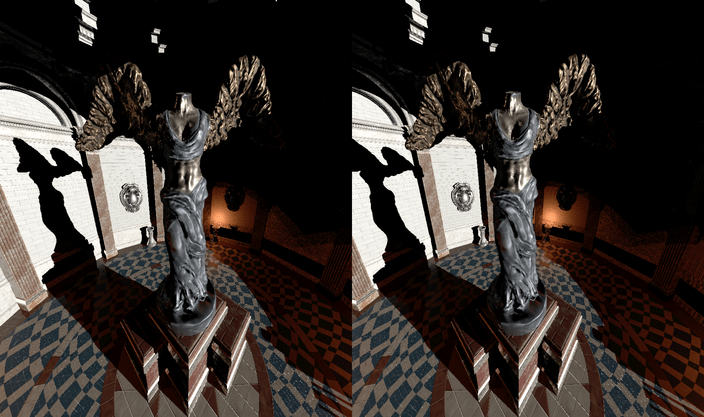</a>

</td>
<td markdown="1" width="60%">
        
### Silva, Velho, [Ray-VR: Ray Tracing Virtual Reality in Falcor](https://gtc21.event.nvidia.com/media/Ray-VR%3A%20Ray%20Tracing%20Virtual%20Reality%20in%20Falcor%20%5BP31198%5D/1_5ji4asvk), GPU Technology Conference (GTC) 2021.

</td>
</tr>

<tr>
<td markdown="1">

<a href="figs/poincare_grid.png">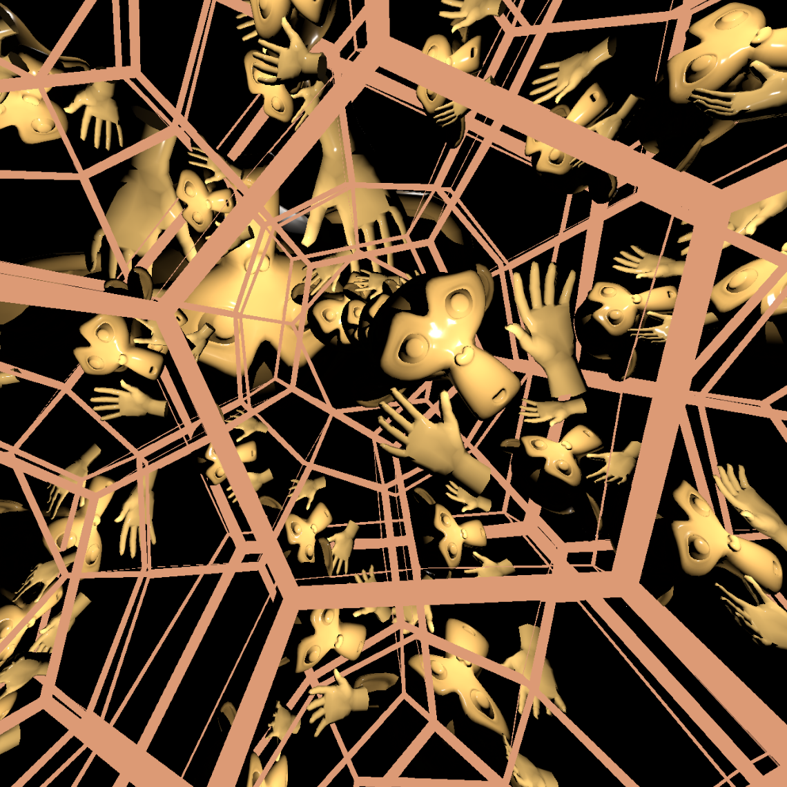</a>

</td>
<td markdown="1" width="60%">
        
### Novello, Silva, Velho, Belolipetsky [How to see the eight Thurston geometries](https://www.doi.org/10.21711/217504322021/em372), Ensaios Matemáticos, Sociedade Brasileira de Matemática.

</td>
</tr>

<tr>
<td markdown="1">

<a href="figs/highres/nil_etc.jpg">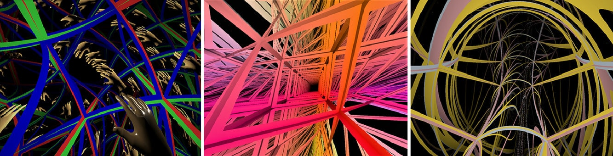</a>

</td>
<td markdown="1" width="60%">
        
### Novello, Silva, Velho, [Intrinsic Visualization in the Thurston’s Geometries](https://www.youtube.com/playlist?list=PLvvfpeSf1IRK29lLgm0QGIDalVzpgHv5t), 33rd Brazilian Mathematics Colloquium. Book to appear.

</td>
</tr>

<tr>
<td markdown="1">

<a href="figs/highres/neural_implicits.png">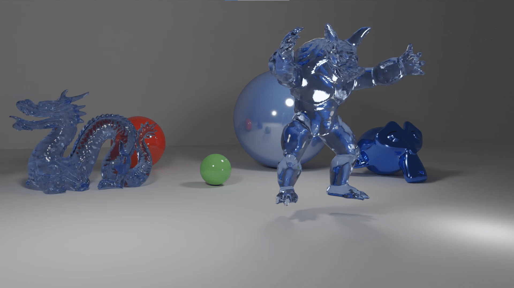</a>

</td>
<td markdown="1" width="60%">
        
### Schirmer, Schardong, Silva, Novello, Yukimura, Magalhaes, Paz, Lopes, Velho, [Neural Networks for Implicit Representations of 3D Geometry](http://sibgrapi.sid.inpe.br/rep/8JMKD3MGPEW34M/45DPE5L), [Tutorial](https://youtu.be/tvy4IGA_iF8), SIBGRAPI 2021.

</td>
</tr>

</table>

## 2020

<table>

<tr>
<td markdown="1">

</td>
<td markdown="1" width="60%">
        
### Silva, Novello, Lopes, Velho, [Proceduray - A light-weight engine for procedural primitive ray tracing](https://arxiv.org/abs/2012.10357), Arxiv.

</td>
</tr>

<tr>
<td markdown="1">

<a href="figs/highres/non_euclidean_path_tracer.png">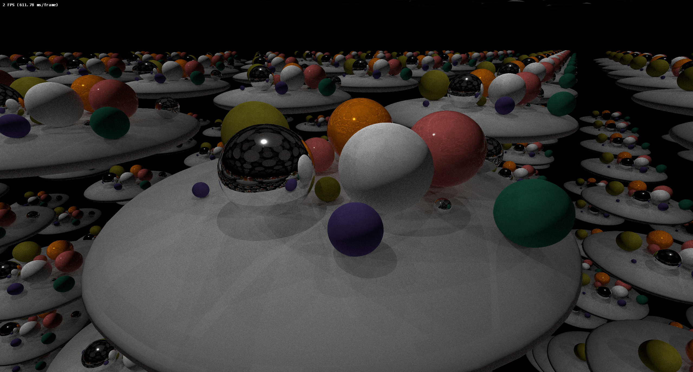</a>

</td>
<td markdown="1" width="60%">
        
### Novello, Silva, Velho, [Global Illumination of Non-Euclidean Spaces](https://doi.org/10.1016/j.cag.2020.09.014), Computers & Graphics. [Preprint](https://arxiv.org/abs/2003.11133).

</td>
</tr>

<tr>
<td markdown="1">

</td>
<td markdown="1" width="60%">
        
### Novello, Silva, Velho, [Visualization of Nil, Sol, and SL2 geometries](https://doi.org/10.1016/j.cag.2020.07.016), Computers & Graphics. [Preprint](https://www.visgraf.impa.br/Data/RefBib/PS_PDF/cag2020a/Visualization_of_Nil_Sol_SL2_CAG.pdf).

</td>
</tr>

<tr>
<td markdown="1">

<a href="figs/highres/seifert_grid.png">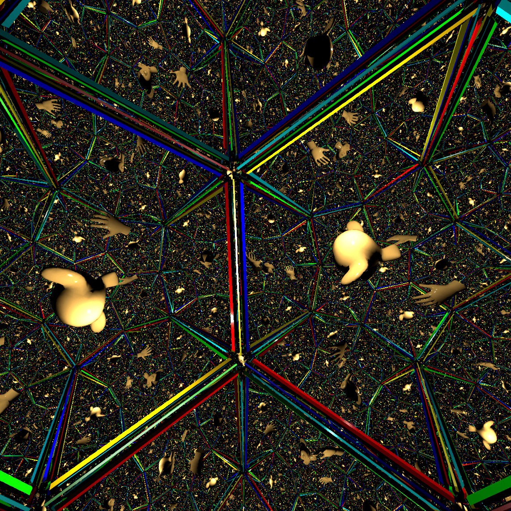</a>

</td>
<td markdown="1" width="60%">
        
### Velho, Silva, Novello, [Immersive Visualization of the Classical Non-Euclidean Spaces using Real-Time Ray Tracing in VR](https://doi.org/10.20380/GI2020.42), Graphics Interface 2020.

</td>
</tr>

<tr>
<td markdown="1">

<a href="figs/highres/illustrating_math.jpg">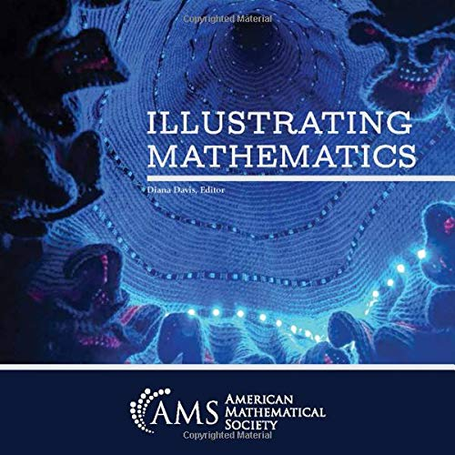</a>

</td>
<td markdown="1" width="60%">
        
### Novello, Silva, Velho, [Illustrating Mathematics, chapter Video and Virtual Reality](https://bookstore.ams.org/mbk-135), American Mathematical Society.

</td>
</tr>

</table>

## 2019

<table>

<tr>
<td markdown="1">

<a href="figs/highres/omicron.jpg">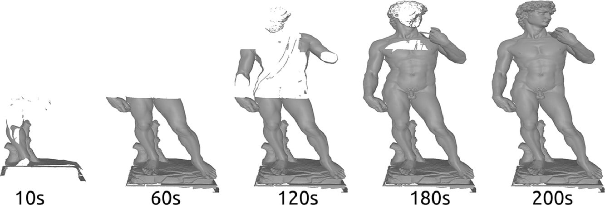</a>

</td>
<td markdown="1" width="60%">
        
### Silva, Esperança, Marroquim, [OMiCroN – Oblique Multipass Hierarchy Creation while Navigating](https://doi.org/10.1016/j.cag.2019.08.016), Computers & Graphics). [Preprint](https://arxiv.org/abs/2006.13266).

</td>
</tr>

<tr>
<td markdown="1">

<a href="figs/highres/david.png">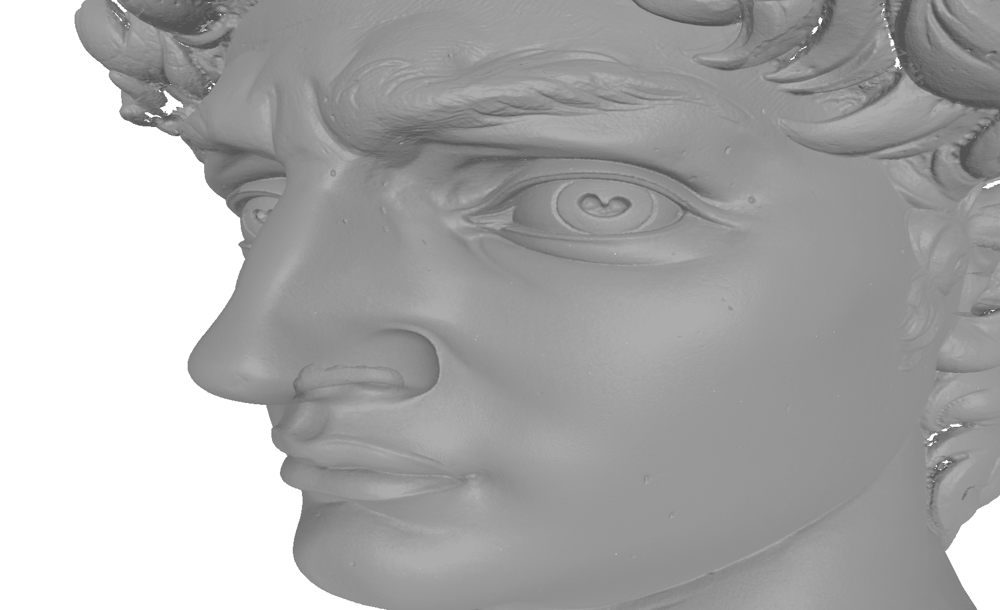</a>

</td>
<td markdown="1" width="60%">
        
### Silva, Esperança, Marroquim, [Concomitant Hierarchy Construction and Rendering of Large Point Clouds](https://doi.org/10.5753/sibgrapi.est.2019.8304), SIBGRAPI 2019, Workshop of Theses and Dissertations.

</td>
</tr>

<tr>
<td markdown="1">

<a href="figs/highres/jua_joints.png">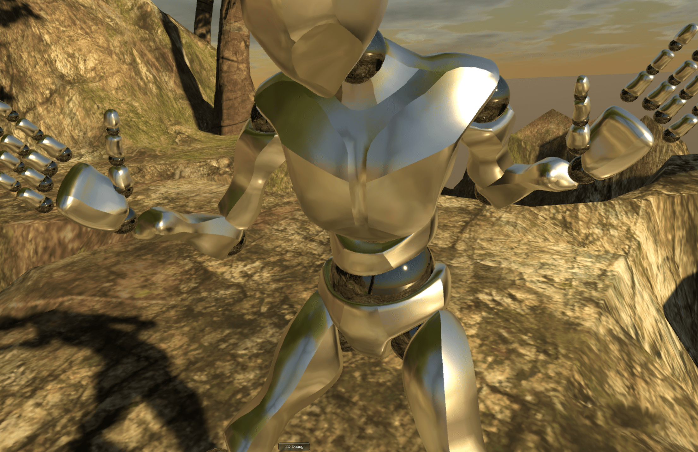</a>

</td>
<td markdown="1" width="60%">
        
### Velho, Giannella, Lucio, Silva, [VR Tour: Guided Participatory Meta-Narrative for Virtual Reality Exploration](https://www.revistageminis.ufscar.br/index.php/geminis/article/view/463), Revista Geminis.

</td>
</tr>
</table>

## 2014

<table>
<tr>
<td markdown="1">

</td>
<td markdown="1" width="60%">
        
### Silva, Esperança, [Lazy Work Stealing for Continuous Hierarchy Traversal on Deformable Bodies](https://doi.org/10.5220/0004656904300437), Proceedings of the 9th International Conference on Computer Graphics Theory and Applications - Volume 1: GRAPP.

</td>
</tr>

<tr>
<td markdown="1">

<a href="figs/highres/funnel.png">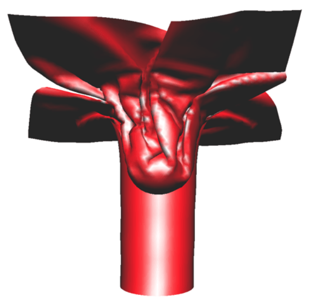</a>

</td>
<td markdown="1" width="60%">
        
### Silva, Esperança, [Lazy Work Stealing for Continuous Hierarchy Traversal on Deformable Bodies](http://www.fgv.br/emap/sibgrapi-2014/SIBGRAPI2014-WTD-posters.html), SIBGRAPI 2014, Workshop of Theses and Dissertations.

</td>
</tr>

</table>

# Projects

<table>
<tr>
<td markdown="1">

&nbsp; | &nbsp;
--- | ---
<a href="figs/highres/rayvr_project1.jpg">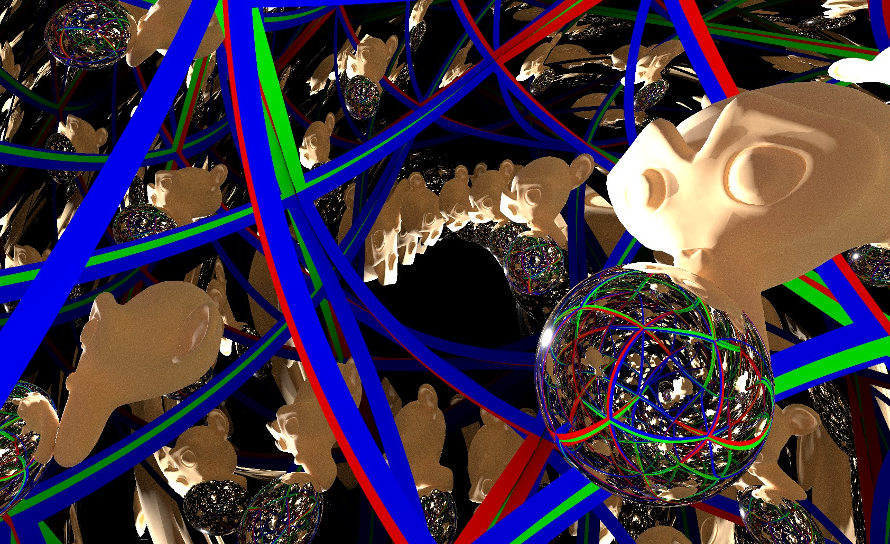</a> | <a href="figs/highres/rayvr_project2.png">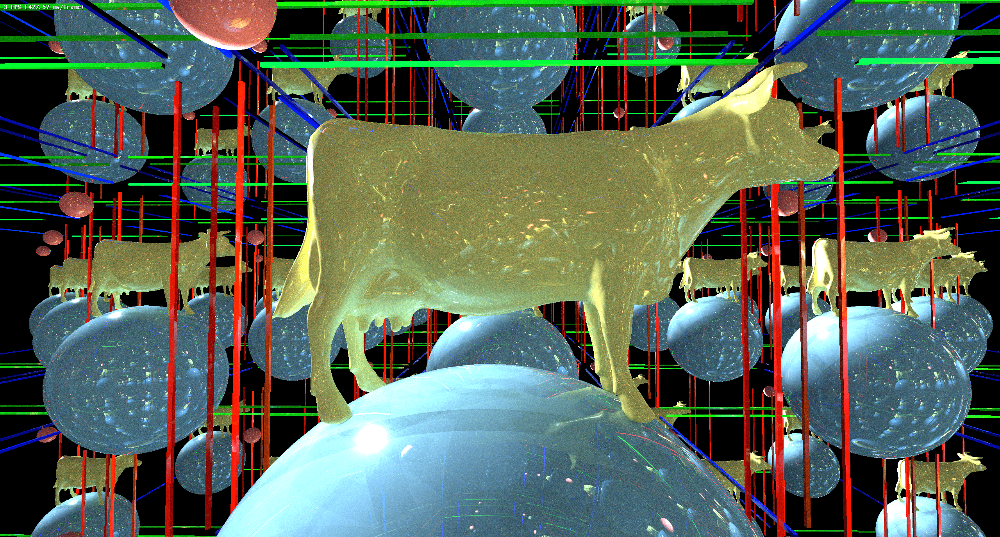</a>
<a href="figs/highres/rayvr_project3.jpg">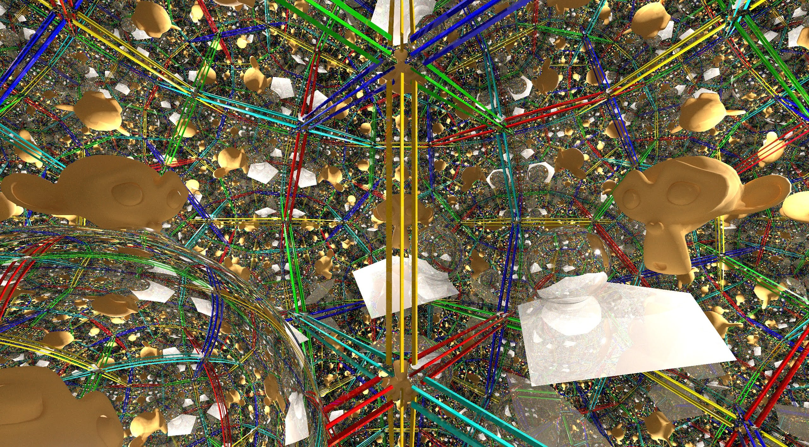</a> | 

</td>
<td markdown="1" width="60%">

## [Ray-VR](https://www.visgraf.impa.br/ray-vr/)

### This project investigates the use of recent capabilities of modern GPUs that implement Ray Tracing in real-time. It combines those features with Virtual Reality to explore new forms of immersive visualization and interaction. One of the objectives is to develop new methods for intuitive exploration of landscapes featuring non-trivial geometry and topology.

</td>
</tr>
<tr>
<td markdown="1">

<a href="figs/highres/mandel.png">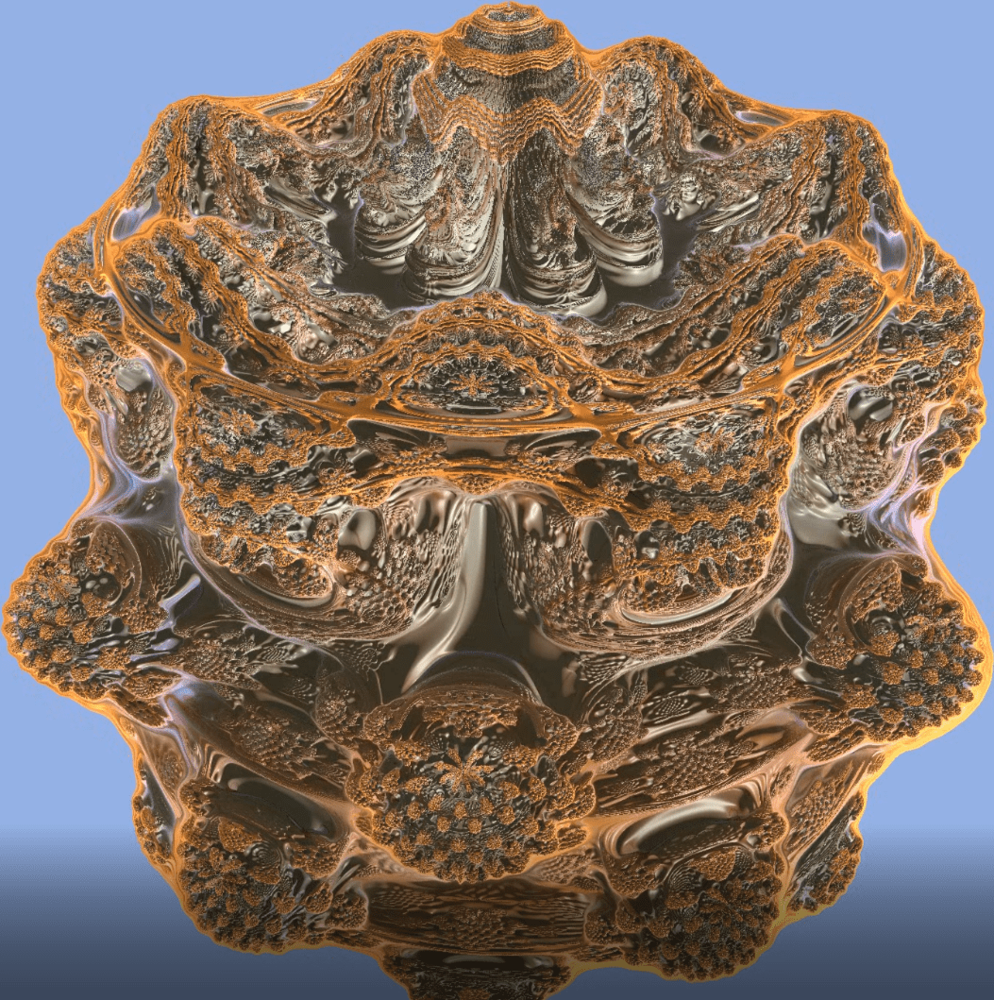</a>

</td>
<td markdown="1" width="60%">

## [Proceduray](https://github.com/dsilvavinicius/Proceduray)

### Proceduray is an engine for real-time ray tracing of procedural geometry. Its motivation is the current lack of mid-level abstraction tools for scenes with primitives involving intersection shaders. Those scenes impose strict engine design choices, since they need flexibility in the shader table setup. Proceduray aims to provide a fair tradeoff between that flexibility and productivity. It also aims to be didactic. Shader table behaviour can be very confusing because parameters for indexing it come from different parts of a system, involving both host and device code. This is different in essence than ray tracing triangle meshes (which uses a builtin intersection shader for all objects) or rendering with the traditional graphics or compute pipelines.

</td>
</tr>
</table>