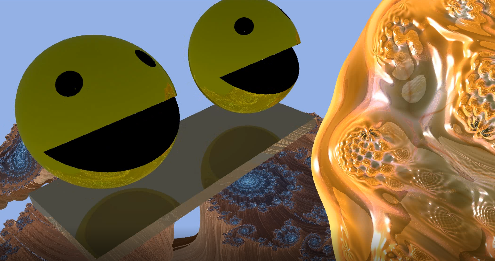

<table>
<tr>
<td markdown="1">

</td>
<td markdown="1">

I'm a Researcher in my second Postdoc at [PUC-Rio](https://www.puc-rio.br/english/ "PUC-Rio's Homepage"), supervised by [Hélio Lopes](http://www-di.inf.puc-rio.br/~lopes/ "Hélio Lopes's Homepage").

My first Postdoc was at [IMPA](https://impa.br/en_US/ "IMPA's Homepage"), supervised by [Luiz Velho](http://lvelho.impa.br/ "Luiz Velho's Homepage").

My research interests are mostly related with real-time Computer Graphics, Virtual Reality, Games and Machine Learning. My current focus is Real-time Ray Tracing and its applications in Virtual Reality, Non-euclidean spaces and Differentiable Rendering. I also work with R&D in real-world problems involving Data Science and Machine Learning.

</td>
</tr>
</table>

# Publications

## 2020

<table>
<tr>
<td>  </td>
<td width="60%">
        
## Silva, Novello, Lopes, Velho, [Proceduray - A light-weight engine for procedural primitive ray tracing](https://arxiv.org/abs/2012.10357 "PUC-Rio's Homepage"), Arxiv

A couple of years after its launch, NVidia RTX is established as the standard low-level real-time ray tracing platform. From the start, it came with support for both triangle and procedural primitives. However, the workflow to deal with each primitive type is different in essence. Every triangle geometry uses a built-in intersection shader, resulting in straight-forward shader table creation and indexing, analogous to common practice geometry management in game engines. Conversely, procedural geometry applications use intersection shaders that can be as generic or specific as they demand. For example, an intersection shader can be reused by several different primitive types or can be very specialized to deal with a specific geometry. This flexibility imposes strict design choices regarding hit groups, acceleration structures, and shader tables. The result is the difficulty that current game, graphics, and scientific engines have to integrate RTX procedural geometry (or RTX at all) in their workflow. A symptom of this attrition is the current lack of discussion material about RTX host code development. In this paper, we propose Proceduray, a ray-tracing engine with native support for procedural primitives. We also discuss in detail all design choices behind it, aiming to foment the discussion about RTX host code.

</td>
</tr>
</table>
